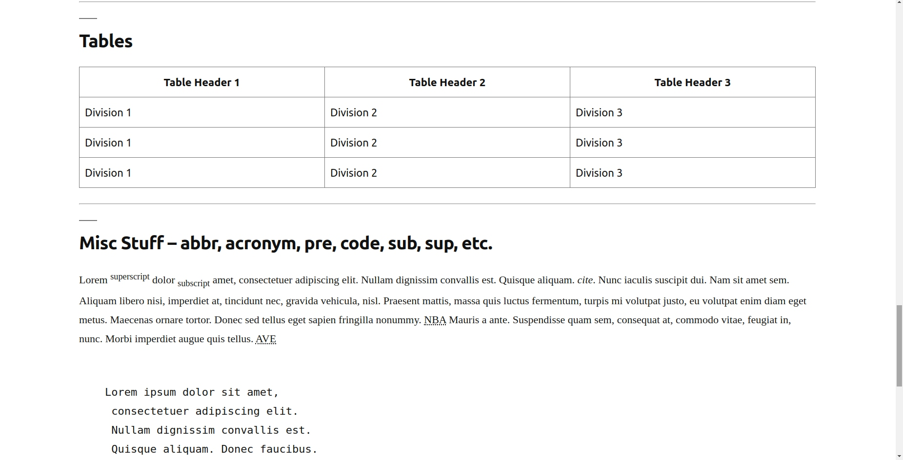

For my term-project I chose to make a website about cats.
Link - https://elizara-georgieva.github.io/WEBD-2020/index.html

##Screenshots

<<<<<<< HEAD

=======

>>>>>>> 6b67c418504376be522bdcd27bcd71d5549bf0f4
